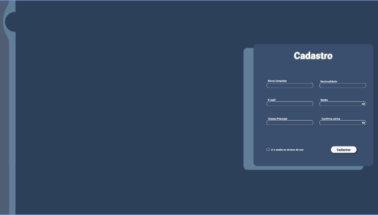
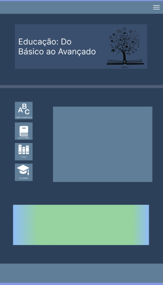

# 🌍 GlobalPass

 GlobalPass é uma plataforma dedicada a apoiar imigrantes e emigrantes em sua jornada de adaptação a um novo país. Nosso objetivo é fornecer informações confiáveis, acessíveis e essenciais sobre aspectos importantes da vida em outro país, como saúde, educação e transporte.

# 🎯Objetivo

Facilitar a adaptação e integração de imigrantes e emigrantes, promovendo a conexão entre culturas e oferecendo suporte durante sua jornada em um novo país.

# 👥Integrantes
[Naiara Rodrigues](https://github.com/naiara623?tab=repositories)

[Kayllany Ketylly](https://github.com/Kayllany04?tab=repositories)

[Laura Melek](https://github.com/LauraMelek2008?tab=repositories)

# 🖥️Prototipo de telas

TELA DE BOAS-VINDAS

TELA DE CADASTRO

TELA DE EDUCAÇÃO

# 🖌️Figma

Acesse o protótipo completo no Figma:

👉[GlobalPass no Figma](https://www.figma.com/design/FO2W79j3uIpQj9vex1nWEU/GlobalPass?node-id=0-1&p=f&t=fRLAKnY8K8Ey3bEj-0) 

# ✅Requisitos Funcionais:
NAIARA:

- O usuário deve ser capaz de se cadastrar na plataforma, editar e excluir sua conta.

O usuário poderá acessar informações como:

- Pontos turísticos

- Postos de saúde

- Leis estaduais de Florianópolis

- Acesso à educação escolar

- Instruções para obtenção de passes de transporte público

KAYLLANY:

- O usuário deve ser capaz de criar uma ou mais postagens.

- O usuário poderá visualizar endereços no Google Maps indicados pela plataforma.

LAURA:

- O usuário deve ser capaz de comentar em uma ou mais postagens.

